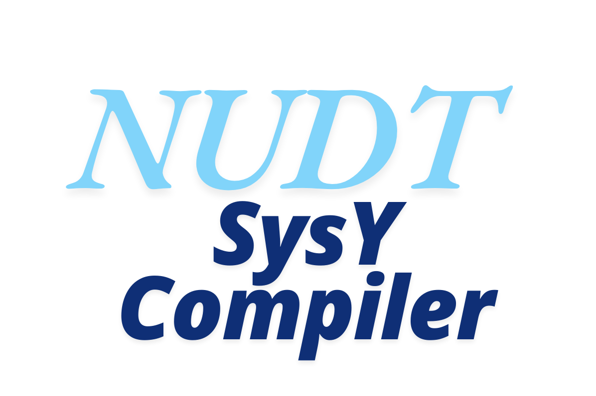
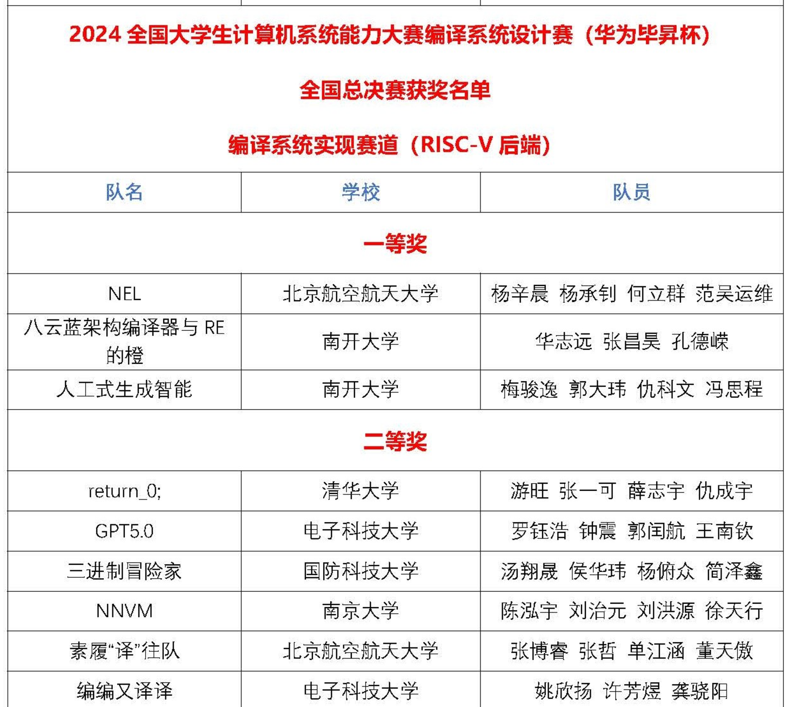
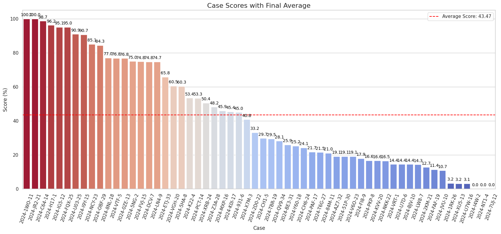
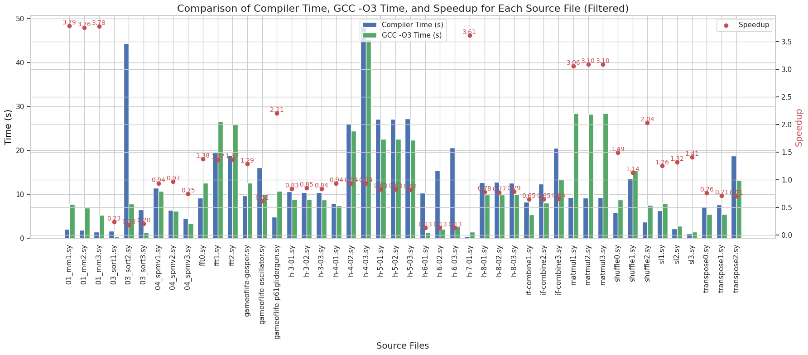
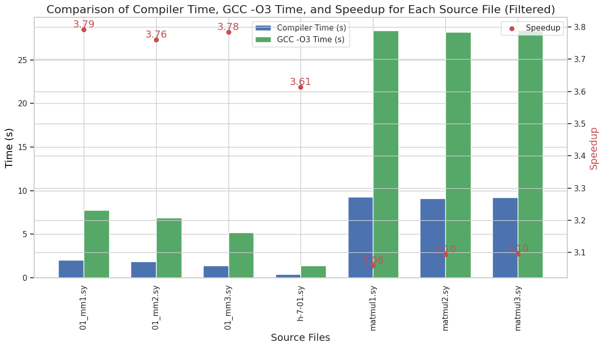
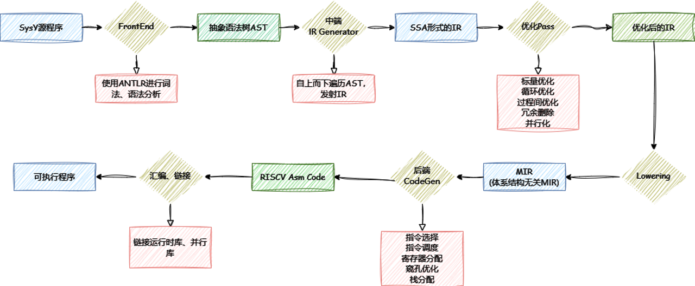
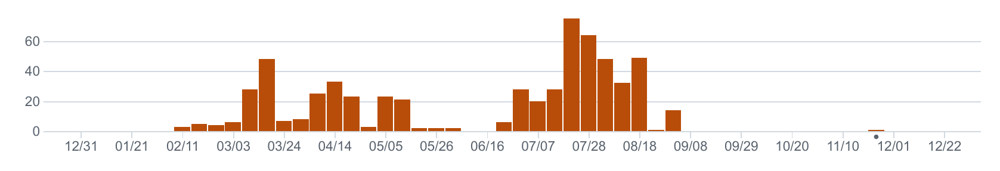
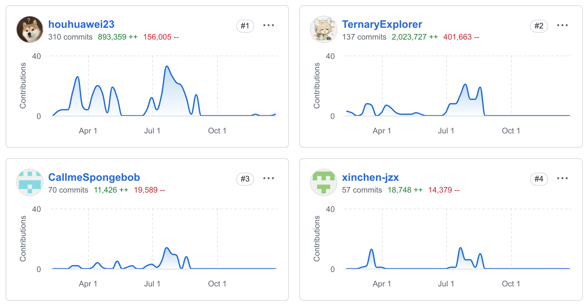

# NUDT SysY Compiler for CSC-2024

> ### "What I cannot create, I do not understand" -- Richard Feynman ^[1]

[1]: https://www.quora.com/What-did-Richard-Feynman-mean-when-he-said-What-I-cannot-create-I-do-not-understand

<p align="center"> 

</p>

<!-- "https://raw.githubusercontent.com/houhuawei23/nudt-sysyc-csc2024/main/NUDT-SysY-Compiler.png" -->

Reconstructioned from [SysYCompiler](https://gitee.com/triple-adventurer/sys-ycompiler).

- [基本情况](#基本情况)
- [项目结构](#项目结构)
- [运行](#运行)
  - [安装依赖](#安装依赖)
  - [Build](#build-the-project)
- [设计/优化技术介绍](#设计优化技术介绍)
- [其他](#其他)
  - [重要时间节点梳理](#重要时间节点梳理)
  - [收获 经验 教训](#收获-经验-教训)
  - [时间安排与建议](#时间安排与建议)

## 基本情况

Contributors 开发者:

- [侯华玮](https://github.com/houhuawei23), [汤翔晟](https://github.com/TernaryExplorer), [杨俯众](https://gitee.com/westme10n), [简泽鑫](https://github.com/xinchen-jzx)

<a href="https://github.com/houhuawei23/nudt-sysy-compiler-csc2024-origin/graphs/contributors">
  
</a>

Made with [contributors-img](https://github.com/lacolaco/contributors-img)

---

- 主要开发周期：2024.02 - 2024.08
- 总代码行数 5W+：
  - 手写代码 3W+，根据自定义模板规则自动生成代码 2W+；
- 使用 [ANTLR4](https://github.com/antlr/antlr4) 生成 C++ 前端（Lexer、Parser），生成 AST
- 参照模仿 [LLVM MLIR](https://mlir.llvm.org/)、[CMMC](https://github.com/dtcxzyw/cmmc) 设计实现了两级中间表示（IR 和 MIR），通过全部功能测试样例：
  - 词法分析、语法分析、语义分析、目标代码生成等；
- 实现若干重要的编译优化技术：
  - 死代码删除、循环剥离、循环并行化等；
- 2024 年全国大学生计算机系统能力大赛-编译系统设计赛-全国总决赛二等奖

<p align="center"> 

- 优化效果概览：

决赛性能得分（vs Best Performance），详细情况分析见[final_result_analysis](./doc/report/final_result_analysis.md)：

<p align="center"> 

比赛结束后修复“依赖关系分析”等 bug 后，加上循环并行化优化后性能（vs GCC-O3）：

<p align="center"> 

在”通用矩阵乘“三重循环上的”循环并行化“优化后效果（vs GCC-O3）：

<p align="center"> 

- 编译器设计框架：

<p align="center"> 

[Commits Histogram](https://github.com/houhuawei23/nudt-sysy-compiler-csc2024-origin/graphs/commit-activity):

<p align="center"> 

[Contributors](https://github.com/houhuawei23/nudt-sysy-compiler-csc2024-origin/graphs/contributors):

<p align="center"> 

## 项目结构

- `src`：源码目录
- `include`：头文件目录
- `third_party`：第三方库目录（需要手动下载）
  - `antlr4`：
    - `antlr4-cpp-runtime-4.12.0-source`：ANTLR4 C++运行时库源代码
    - `antlr-4.12.0-complete.jar`：ANTLR4 Java jar 包
- `doc`：文档目录
- `test`：测试目录，包含测试用例（需要手动下载）

## 运行

- 推荐使用 Debian-12 bookworm 或 Ubuntu 22.04
- 可使用 wsl2，推荐使用裸机 linux 或双系统

### 安装依赖

#### 下载并安装 ANTLR4

- [ANTLR4 Releases](https://github.com/antlr/antlr4/releases)
- [ANTLR4 Downloads](https://github.com/antlr/website-antlr4/tree/gh-pages/download)

这里使用了 ANTLR4 4.12.0 版本，与比赛测试环境中版本一致。

- 下载 antlr4 jar package [antlr-4.12.0-complete.jar](https://github.com/antlr/website-antlr4/blob/gh-pages/download/antlr-4.12.0-complete.jar)
- 下载 ANTLR4 C++运行时库源代码 [antlr4-cpp-runtime-4.12.0-source.zip](https://github.com/antlr/website-antlr4/blob/gh-pages/download/antlr4-cpp-runtime-4.12.0-source.zip)
- 加压到 `third_party/antlr4/` 目录下

在 `third_party/antlr4/antlr4-cpp-runtime-4.12.0-source/` 目录下，执行：

```bash
# pwd: path_to/third-party/antlr4/antlr4-cpp-runtime-4.12.0-source/
mkdir build
cmake -S . -B build -DANTLR_JAR_LOCATION=$(realpath ../antlr-4.12.0-complete.jar) -DWITH_DEMO=True
cmake --build build -j$(nproc)
cmake --install build # install to /usr/local/
```

#### 安装其他依赖

##### must

```bash
sudo apt-get update
sudo apt-get install -y build-essential uuid-dev libutfcpp-dev pkg-config make git cmake openjdk-11-jre
```

##### optional

```bash
# llvm clang
llvm-15-dev

# ninja
ninja-build

# google test
libgtest-dev

# cross-compiler
sudo apt install gcc-riscv64-linux-gnu # or gcc-riscv64-unknown-elf,gcc-11-riscv64-linux-gnu, gcc-arm-linux-gnueabihf

# g++
g++-12-riscv64-linux-gnu
g++-12-arm-linux-gnueabihf

## tldr: Simplified and community-driven man pages
sudo apt-get install -y tldr && tldr -u

```

### Build the project

```bash
# cd to project root directory

# default use Unix Makefiles
mkdir build
cmake -S . -B build
cmake --build build -j$(nproc)

# use Ninja
cmake -s . -B build -G Ninja
cmake --build build -j$(nproc)

# generate ./compiler executable under project root directory
# ./compiler has two different command line args parse method:
# one for local test, one for official server test
# 1 local test:
Usage: ./compiler [options]
  -f {filename}                     input file
  -i                                Generate IR
  -t {passname} {pasename} ...      opt passes names to run
  -o {filename}                     output file, default gen.ll (-ir) or gen.s (-S)
  -S                                gen assembly
  -O[0-3]                           opt level
  -L[0-2]                           log level: 0=SILENT, 1=INFO, 2=DEBUG

./compiler -f test.sy -i -t mem2reg dce -o test.ll
./compiler -f test.sy -S -t mem2reg -o test.s

# 2 official server test:
./compiler -S -o test.s test.sy
./compiler -S -o test.s test.sy -O1


```

#### Run the test

```bash
# bash test script
./test.sh -t test/2021/functional/ -p mem2reg -p dce -p scp -p sccp -p simplifycfg -L1
./test_asm.sh -t test/2021/functional/ -p mem2reg -p dce -p scp -p sccp -p simplifycfg -L1

# python test script (multi-threading)
python ./submit/runtest.py compiler_path tests_path output_asm_path output_exe_path output_c_path
```

## 设计/优化技术介绍

### 中端中间表示 (IR) 设计与实现：

- 静态单赋值（Static Single Assignment）
  - 每个变量只能被赋值一次，且赋值语句只能出现在其定义之前；简化了数据流分析，允许更简单有效的优化技术；
- 目标无关（Target-Independent）
  - IR 指令与目标无关，可方便地生成不同目标平台的机器代码；
- 强类型系统（Strongly Typed）
  - 变量类型由声明时确定，不能隐式转换；
- 贴近底层操作（Low-Level Operations）
  - 支持接近底层的操作，如算术操作、逻辑操作、内存操作、控制流等；
- 序列化（Serialization）后与 LLVM IR 兼容
  - 便于利用 LLVM 相关工具链进行调试测试

```cpp
namespace ir {
class Use;
class User;
class Value;

class ConstantValue;
class Instruction;
class BasicBlock;
class Argument;

class Function;
class Module;
//...
}
```

### 分析/优化遍总览

- 分析遍 x14; 优化遍 x38
- 分析遍
  - 数据流、控制流分析
  - 循环、归纳变量分析
  - 依赖关系分析
  - IR 标准化检查
  - ...
- 优化遍
  - 标量优化：GCM, GVN, SCCP, LICM...
  - 控制流优化：SimplifyCFG, BlockSort...
  - 死代码删除优化：DCE, ADCE, DLE, DSE...
  - 循环优化：展开、剥离、交换、并行化...
  - 过程间优化: TCO, ...
  - ...

```bash
./src/pass/analysis
├── callgraph.cpp
├── CFGAnalysis.cpp
├── CFGPrinter.cpp
├── CMakeLists.txt
├── ControlFlowGraph.cpp
├── dependenceAnalysis
│   ├── DependenceAnalysis.cpp
│   └── dpaUtils.cpp
├── dom.cpp
├── indvar.cpp
├── irtest.cpp
├── loop.cpp
├── MarkParallel.cpp
├── pdom.cpp
└── SideEffectAnalysis.cpp
2 directories, 14 files
```

```bash
./src/pass/optimize
├── CFG
│   └── simplifyCFG.cpp
├── CMakeLists.txt
├── DCE
│   ├── ADCE.cpp
│   ├── DAE.cpp
│   ├── DCE.cpp
│   ├── DeadLoopElimination.cpp
│   ├── DLAE.cpp
│   ├── DLE.cpp
│   └── DSE.cpp
├── InstCombine
│   └── ArithmeticReduce.cpp
├── IPO
│   ├── inline.cpp
│   └── TCO.cpp
├── Loop
│   ├── LoopBodyExtract.cpp
│   ├── LoopDivest.cpp
│   ├── LoopInterChange.cpp
│   ├── LoopParallel.cpp
│   ├── LoopSimplify.cpp
│   ├── LoopSplit.cpp
│   ├── LoopUnroll.cpp
│   ├── LoopUtils.cpp
│   └── ParallelBodyExtract.cpp
├── mem2reg.cpp
├── Misc
│   ├── BlockSort.cpp
│   ├── GepSplit.cpp
│   ├── indvarEndvarRepl.cpp
│   └── StatelessCache.cpp
├── reg2mem.cpp
├── Scalar
│   ├── AG2L.cpp
│   ├── GCM.cpp
│   ├── GlobalToLocal.cpp
│   ├── GVN.cpp
│   ├── LICM.cpp
│   ├── Reassociate.cpp
│   ├── SCCP.cpp
│   ├── SCEV.cpp
│   ├── SCP.cpp
│   └── SROA.cpp
└── Utils
    └── BlockUtils.cpp
9 directories, 38 files
```

### 后端优化介绍

- 基于模板的指令选择: 通过定义模板自动生成 "匹配-替换" c++ 代码
- 图着色寄存器分配
- 基本块内的指令调度-表调度
- 基本块冷热代码调度
- 窥孔优化

## 其他

### 重要时间节点梳理

- [timeline.mw](./timeline.mw) or [online](https://meridiem.markwhen.com/houhuawei23/timeline)

<br>

- 寒假: 1 month
  - 学习编译原理, 编写 antlr4 g4 词法语法文件
- 大三下: 4 month
  - ast -> ir
  - ir -> asm
  - 中端后端优化
- 暑假: 1 month
  - 并行化和其他

<br>

- 2023.12.08 第一次编译比赛宣讲
- 2023.12.21 “编译比赛小群” 4 人群建群
- 2024.01.24 2nd 培训
  - 下午: 梳理了编译的基本流程和编译器的基本结构; 前端算法介绍
  - 晚上: 开发环境配置 和 antlr4 使用简介
  - 布置寒假任务:
    - 熟悉 Sys2022 语言规范
    - 利用 antlr4 实现编译器前端，实现 c -> ast
- 2024.03.08 3rd 培训讲解:
  - 静态单赋值 SSA (Part1);
  - IR 数据结构的一般设计 (Value-Use-User)
- 2024.03.22 往届参赛队经验分享 arm x 2
- 2024.03.29 培训
  - 静态单赋值 SSA (Part2);
  - 往届参赛队经验分享 riscv
- 2024.04.12 培训:
  - 代码生成
- 2024.04.20 比赛正式公示开赛
  - 语法/目标平台跟 23 年保持一致
- 2024.04.24 下发开发板
- 2024.05.17 培训: 协同开发环境搭建/自动化测试
- 2024.05.24 比赛第一次官方培训 湖大
  - 往后每周末基本都有官方培训 内容包括
    - 赛题介绍 编译器设计与测试 中间表示设计 优化
    - 上届优秀参赛队经验分享 cmmc 郑英炜
- 2024.05.30 截止报名 +7days
  - 在线测评系统开放 可以提交代码测评 实时排名
  - 一次测评需要 1 个多小时，建议本地先做好测试 (docker 编译环境/开发板测试)
- 2024.07.20 暑假开始
  - 以参加比赛作为暑期实习
- 2024.08.10 初赛截止
  - rv 6th; arm 5th, 6th
  - rv 41, arm 16
- 2024.08.18 - 08.22 现场决赛 杭电
- 2024.09.03 开学 暑假结束
- 2024.09.04 暑期实习报告; 赛后交流总结
- 2024.09.10 拿到获奖证书 (电子版)

### 收获 经验 教训

#### 经验

> “经验可能成为一种束缚，让你看不到真正的可能性。” -- 史蒂夫·乔布斯

- > "跟对人 走对路 做对事"
  - 往届参赛队的经验教训
  - 学习高质量的代码 cmmc
- 工程量大，实现赛越来越卷，需要尽早准备和开展工作
- 及时整理归档资料，Q&A
  - “吃一堑，长一智”
- 尽可能充分的测试 challange your code
  - 单元测试，集成测试，模糊测试，回归测试
  - 官方样例 模糊测试生成样例
  - 使用官方提供的编译测试环境 (docker)
    - clang 12
- 速度 vs 质量
  - 速度:
    - 要尽快构建起“最小可运行程序”，能够测试最简单的样例，也就是要先跑起来再说，先打通流程再逐步细化
  - 质量:
    - 程序框架: 程序架构/编程范式/设计模式
    - 程序细节: 代码质量（严谨性/通用性/可移植性）
    - 否则随着代码量增加，整个程序将变成石山，非常痛苦
  - 两手抓、两手都要硬:
    - 在追求速度的同时要注重程序质量，在保证程序质量的同时也要注意尽快跑起来
    - 一般来说，要先实现一个能测试最简单样例的程序，然后在逐步细化时要及时代码重构
    - 速度决定你能很快上路，质量决定你能走多远
  - 如何提高代码质量
    - 时刻葆有对高质量代码的追求
    - 编程语言选择: “更安全”的语言?
    - 阅读优秀代码, 学习设计思路和实现方式
    - 阅读 Effective XXX
    - 在 coding 中体会
      - 尽可能写注释: 函数的处理思路/边界情况...
      - 站在别人的角度写代码 让别人好懂你的代码

#### 教训

> “我们从历史中学到的唯一教训，就是我们从未从历史中吸取教训。” -- 黑格尔

##### c++ nullptr, segfault

> “I call it my billion-dollar mistake. It was the invention of the null reference in 1965... This has led to innumerable errors, vulnerabilities, and system crashes.” \
> 我称之为我的十亿美元错误。这是我在 1965 年发明的空引用... 它导致了无数的错误、漏洞和系统崩溃。 \
>  -- Tony Hoare（空指针概念的提出者）

- ! 导致决赛时多线程并行化 seg fault
- 减少裸指针使用, 使用 "传值" or "传引用"
- 尽量避免生成空指针
- 函数对传进来的裸指针参数要做 "空指针判断" `ptr == nullptr`

##### "正确的"优化

> "大胆假设 小心求证"

- ! 错误的窥孔优化 => 3 个测试样例 wrong ans
- 保证你的优化是 "正确的", 要在逻辑/数学上充分论证
- 大的优化遍算法要理解 边界情况要注意
- 小的窥孔优化/变换 要穷尽各种可能 确保正确
- 将自己的优化思路跟队友交流探讨

##### 系统、整体地看问题, 前后端既要分离分工又要统一统筹

> “只有用普遍联系的、全面系统的、发展变化的观点观察事物，才能把握事物发展规律。” \
> -- 习近平 党的二十大报告

- ! ir 随意设置 ptr.size = 4 bytes
  - => 后端生成汇编时 函数调用返回地址 (8bytes) 被覆盖 [调试了 2 天]
- ! 中端 mem2reg + reg2mem 后给到后端寄存器分配
  - => 性能差 [百思不得其解了 1 周]
  - 相当于: 只给中间临时变量寄存器分配, 没有给实际变量寄存器分配
  - 前后端分离割裂 没有把握整体思路
- 你在此处写下的代码是否会影响到其他程序?

##### 提高代码质量 及时重构 最好不要完全重写

> "编程偶遇石山代码, 逻辑混乱细节繁杂如同怪物, 拼尽全力无法战胜。" \
> "并非偶遇"

- ! 2024-05 时发觉中端代码已逐渐石山, 决定重写, 耗费 1 月最终放弃
- 高质量要求 及时重构

##### 团队协作

> "精诚所至 金石为开"

- 路途遥远 困难重重, 唯有与同伴相互支持 精诚协作, 才能战胜一切困难险阻
- 及时努力完成任务 有情况有问题有想法及时交流 不要一声不吭
- 5-6 月份各种作业/实验/考试/夏令营/套磁/实习 事情会很多很忙 要及时跟队友交流说明

#### 收获

> 一分耕耘，一分收获。

- 奖项 and 加分
- 深入理解编译器的设计与实现 初入编译领域
  - 什么是 "编译" 一种广义上的理解
- 体验如何从 0 开始设计构建一个中等规模的系统软件
  - 获得一种自信 "啊哈 不过如此嘛!"
  - "祛魅"
- 提升综合能力 系统能力
  - 遇到问题解决问题的能力
  - 各种计算技术技能 cmake, git, morden c++ ...
  - 团队分工协作
- 并肩作战的战友情谊
  - > "一起扛过枪，一起同过窗"
- To be continued...

> 最后是关于编译器设计的一点想法，编译是程序的转换，一般是由较高抽象级的语言转换成较低抽象级的语言，在转换过程中必然存在信息的损失。编译优化就是利用程序中的信息，对程序进行等价变换，以变换成更优的程序。所以编译过程中最核心的问题就是如何保维护和保留更多的源程序信息，以方便分析和优化。从这个问题铺展开来，就涉及到如何设计中间表示，是否要设计多级中间表示，中间表示有哪些指令，如何做信息损失最少的程序变换... [OverView.md](./doc/OverView.md)

- 广义上讲, 从人类思维到电子电路的每一层抽象都可以视作是中间语言.
- 而从一种语言到另一种语言的等价转换即是 "编译"
- 无处不在的编译:
  - html -> web,
  - ai/ml compiler: cuda, pytorch, tvm, triton
  - 排版工具: latex, typst ...
- 关键在于"中间表示":
  - 如何表示开发人员想要表达的语义信息
  - 如何封装抽象更底层的信息
  - 如何在中间表示上优化变换

### 时间安排与建议

> "如果你没有计划，那你就是在计划失败。" -- 本杰明·富兰克林

- 寒假 2025-01-17 / 2025-02-17 (1 month)
  - 没有必要学习编译原理
  - 了解编译的基本流程和编译器的基本结构后可以开始着手看代码，写代码
  - 推荐一些高校的编译课程实验文档/指导书
    - [BUAA miniSysY-tutorial](https://github.com/No-SF-Work/miniSysY-tutorial)
    - [nku-rust-doc](https://junimay.github.io/nku-compiler-2024-rs/index.html)
    - [北大编译实践在线文档](https://pku-minic.github.io/online-doc/#/)
    - [THU minidecaf](https://decaf-lang.github.io/minidecaf-tutorial/)
  - 建议基本完成前端 (词法/语法解析), 生成 ast
- 大三下 2025-03 / 2025-06 (4 month)
  - 建议每天每周汇报进度, 聚焦测试样例通过率
  - 中端 ast => ir (1 month)
    - 建议序列化为 llvm-ir, 方便利用 llvm 工具链进行测试
  - 分工: 中端优化 x2 后端搭建 x2 or 后端搭建 x4
  - 后端 ir => asm (1.5~2 month)
  - 分工: 中端优化 x2 后端优化 x2 (1 month)
- 暑假 2025-07 (离初赛截止约 1 month)
  - 集中开发, 进一步挖掘测试样例的优化空间
  - 多线程并行化/SROA 等高级优化
  - 决赛前一定要将开发进度合龙, 前后端优化遍全加全过
    - (不要到决赛现场再合龙, 来不及, 根本来不及)
- 初赛截止 8 月初
- 决赛 8 月中旬:
  - 2~3 天, 除了临场调试修改, 不建议留太多工作, 没时间做
