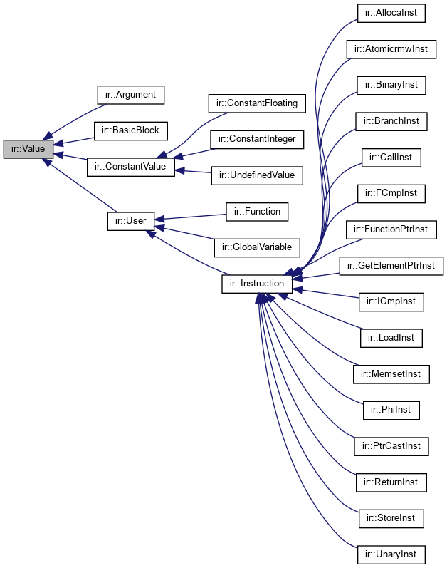
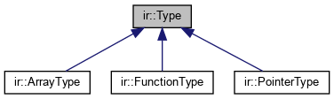

# ast->ir 实验指导

- [nudt old 框架](https://gitee.com/ccrg/sysy)，有实验 1-3，实验 2 为 `ast->ir`

### Simplest Case

c -> llvm ir

```c
int main() {
  return 1;
}
```

==>

```llvm
define i32 @main() {
  %1 = alloca i32
  store i32 0, ptr %1
  ret i32 1
}
```

### IR

中间表示 (IR)可以有三种形态：

- 用以高效分析和变换的内存表示 (in-memory form)，
- 用以存储和交换的字节码 (bytecode form)，
- 以及用以阅读和纠错的文本表示 (textural form)。

以 Value 为父基类的 ir 数据结构层次：

<p align="center"> 

类型系统：

<p align="center"> 

更多介绍参考 [00_intro#IR-设计](../00_intro/intro.md#ir-设计)

### ast -> ir 程序的主要过程：

- 输入`字符流`经过词法语法分析后得到`抽象语法树 AST`，即拿到语法树的根节点 `CompileUnit`
- 从根节点开始，遍历语法树，发射语法树节点所对应的 ir 数据结构对象（一般采用 visit 模式和 builder 模式）
- 将内存中 ir 数据结构对象输出为可读的 ir 文本

### 开发者主要工作：

- 学习理解经典的 ir 设计，如 llvm ir，体会 ir 设计的思想和设计的结构
- 根据对 ir 的理解与定义，编写代码实现 ir 的数据结构:
  - `Value`, `Type`, `Module`, `Function`, `BasicBlock`, `Instruction`等
- 编写 `visitXXX` 函数，即当遍历到某个语法树节点时，按照语义，应如何生成对应的 ir 对象
- 常会利用 `IRBuilder` 来封装一些常见的生成 ir 的方法和信息，从而更方便快捷安全地生成 ir
  - 信息：符号表，控制流信息等
  - 方法：生成某类型指令，类型提升等
- 步骤
  - 先搭建其最基本的数据结构（如 `Value`体系、类型系统、`IRBuilder`等），将最简单的 c 程序转换成 ir （如上述 `return 1`程序）
  - 建议将 ir 文本化为与 llvm ir 兼容的形式，从而可以使用 llvm 编译工具链进行测试，即 `lli`
  - 比赛提供了往届的功能测试样例 functional_test，一共 100 个左右，从最简单的 `return 1` 开始，随着编号增加，测试样例越来越复杂
  - 一个一个 pass 测试样例，根据下一个想通过的测试样例中所用到的 c 语言特性，扩充代码（添加新的指令，新的数据结构等）
  - 如此便从简单到复杂实现所有的 sysy 语法特性

### 测试流程：

- infile.c -> our compiler -> out.ll
- out.ll -> `lli` -> 执行结果
- 比较执行结果 与 直接用 gcc/clang 编译运行的结果
- 一样则说明 ir 生成的正确，否则生成的 ir 有问题

`lli` 是 llvm 编译工具链中的工具，是 llvm ir 的解释器，可以执行我们生成的 ir。

- 一般会编写测试脚本（bash/python）来进行自动化批量测试
- 要注意回归测试，即通过新的样例时，同时要检查之前通过的样例是否仍然正确
- 如果能够实现持续集成（CI），即推送代码后自动编译测试、汇报测试结果，则更好不过了

## 助学材料（很有用的哦，建议看看）

- 比赛规则、语言规范、测试样例、往届比赛代码等
  - [gitlab/CSC-Compiler: 全国大学生计算机系统能力大赛-编译系统设计赛 官方仓库](https://gitlab.eduxiji.net/csc1/nscscc)
- 如何使用 visit 模式
  - [ANTLR 4 权威指南.pdf](./antlr4/ANTLR%204权威指南.pdf)
- 学习理解 LLVM IR 的设计架构和设计思想
  - 重点理解以 `Value` 为核心的类层次结构 + `Type` 为核心的类型系统
  - [LLVM IR Reference](https://llvm.org/docs/LangRef.html)
  - [The Core LLVM Class Hierarchy Reference](https://www.llvm.org/docs/ProgrammersManual.html#the-core-llvm-class-hierarchy-reference)
  - [Compilers and IRs: LLVM IR, SPIR-V, and MLIR. 2022.01.08](https://www.lei.chat/posts/compilers-and-irs-llvm-ir-spirv-and-mlir/)
- 在线编译器，可以用来观察 c -> llvm ir/asm：
  - [Compiler Explorer (godbolt.org)](https://godbolt.org/)
  - 使用 clang 生成 llvm ir 的编译器参数：`clang test.c --emit-llvm -O0 -o test.ll`
- 当然还有往届参赛队的代码！！
  - 可以通过 debug 的方式来一步一步运行其代码，理解其结构和设计
    - 推荐使用 vscode 的 `launch.json` 实现优雅的 debug
  - 可以使用 `doxkygen` 来自动生成代码文档（类的继承关系等）
- 自动化测试脚本参考：
  - bash 版本的: [`test.sh`](../../../test.sh)
  - python 版本的: [`runtest.py`](../../../submit/runtest.py)

### `doxkygen` 来自动生成代码文档

```bash
# cd to nudt-sysyc-csc2024 main folder
doxygen Doxyfile
# running generate....
```

生成完毕后，可以在 `.doxy` 目录下看到生成的文档网页的文件，进入 `.doxy/html`，双击 `index.html` 即可打开文档的本地静态网页
